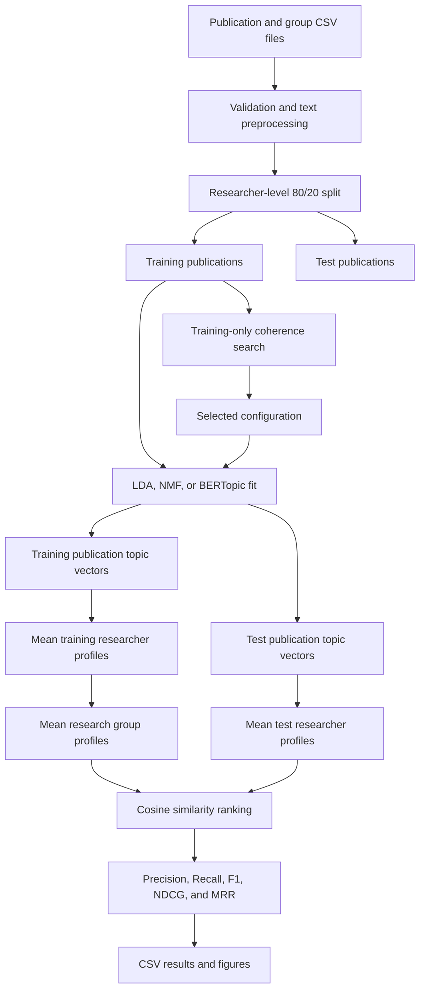

# Researcher-to-research-group recommendation

[](https://www.python.org/)


This repository contains a publication-based recommendation experiment that ranks computer science research groups for researchers. It compares Latent Dirichlet Allocation (LDA), Non-negative Matrix Factorization (NMF), and BERTopic under the same data split, profile construction, cosine ranking, and evaluation procedure.

The study uses 11,111 prepared publication documents from 3,257 researchers across 12 CSRankings research areas. Parameter selection is performed on the training partition with C_v topic coherence. Final recommendation quality is measured on 652 held-out researchers using Precision@K, Recall@K, F1@K, NDCG@K, and mean reciprocal rank (MRR).

> [!NOTE]
> This is research code for a controlled comparative experiment. It is not a deployed researcher-placement service and does not provide an interactive application or API.

## Contents

- [Research scope](#research-scope)
- [Method](#method)
- [Dataset](#dataset)
- [Installation](#installation)
- [Reproducing the experiment](#reproducing-the-experiment)
- [Configuration](#configuration)
- [Results](#results)
- [Generated artifacts](#generated-artifacts)
- [Repository structure](#repository-structure)
- [Reproducibility](#reproducibility)
- [Development notes](#development-notes)
- [Known limitations](#known-limitations)
- [Future work](#future-work)
- [Research documentation](#research-documentation)
- [Citation](#citation)
- [License](#license)
- [Contact](#contact)

## Research scope

Matching researchers to suitable research groups is usually a multi-label ranking problem: one researcher may have several relevant groups. This project tests whether topic distributions derived from publication titles and abstracts can support that ranking task.

The comparison is deliberately narrow. Only the publication representation changes between model runs. The researcher split, aggregation rules, candidate groups, similarity function, and metrics remain fixed.

The repository provides:

- training-only coherence search for LDA, NMF, and BERTopic;
- researcher-level train and test separation;
- publication, researcher, and group representations in each model's topic space;
- cosine-similarity rankings for all candidate groups;
- complete and top-K recommendation exports;
- aggregate ranking metrics, topic statistics, runtimes, and paper figures;
- implementation, experiment, and results audits for traceability.

## Method

### Workflow



### Text preparation

Each document is the publication title joined with its abstract. The loader creates two views:

| View | Used by | Processing |
|---|---|---|
| `document` | BERTopic embeddings | Whitespace normalization while retaining original text |
| `bow_document` | LDA, NMF, and C_v coherence | Lowercase text, punctuation removal, alphanumeric token filtering, NLTK English stopwords, and research-jargon stopwords |

Author names are split on semicolons. Only authors present in the group-label file are retained. A publication can produce more than one modeling row when several labelled coauthors appear in its author list.

### Topic representations

| Model | Publication representation | Selected configuration |
|---|---|---|
| LDA | Topic probabilities from count vectors | 29 topics, 20 iterations, batch learning |
| NMF | Topic factors from an internal TF-IDF matrix | 11 topics, 800 iterations, NNDSVDa initialization |
| BERTopic | Approximate topic distribution from a SPECTER-based BERTopic model | `allenai/specter`, minimum topic size 45, 50 UMAP neighbors, 5 UMAP components |

BERTopic uses cosine-distance UMAP followed by HDBSCAN. After fitting, the pipeline reassigns outliers with `reduce_outliers(strategy="embeddings")` using the same SPECTER embeddings, then calls `update_topics()`. Researcher recommendations use BERTopic's `approximate_distribution()` output rather than cluster labels or raw SPECTER embeddings.

### Profiles and ranking

For each model, a researcher profile is the arithmetic mean of that researcher's publication vectors. A group profile is the mean of the available profiles of its training members. Test researchers never contribute to group profiles.

Each test researcher profile is compared with every available group profile using cosine similarity. Groups are ranked by decreasing score, with alphabetical order used to break exact ties.

### Evaluation

The experiment reports macro means across test researchers:

- Precision@1, Precision@3, Precision@5
- Recall@1, Recall@3, Recall@5
- F1@1, F1@3, F1@5
- NDCG@1, NDCG@3, NDCG@5
- MRR

Researchers may have multiple relevant groups. Ground truth comes from their CSRankings area memberships.

## Dataset

The experiment reads two checked-in CSV files:

| File | Required columns | Role |
|---|---|---|
| `data/publications_2015_2025_10k_plus.csv` | `Title`, `Abstract`, `Authors` | Publication text and researcher names |
| `data/groups_2015_2025_10k_plus.csv` | `researcher_name`, `group_name` | Multi-label ground truth |

The publication file also includes `Year`, `Venue`, and `DOI`, but the experiment does not use those fields for modeling.

### Prepared dataset statistics

| Statistic | Value |
|---|---:|
| Unique prepared publication documents | 11,111 |
| Researchers | 3,257 |
| Research groups | 12 |
| Training researchers | 2,605 |
| Test researchers | 652 |
| Mean prepared publication rows per researcher | 6.13 |
| Median prepared publication rows per researcher | 2 |
| Range | 1 to 59 |

The raw publication CSV contains 11,681 rows. After author matching and expansion, preprocessing produces 19,970 author-publication rows representing 11,111 unique document strings. Use the appropriate unit when reporting dataset size.

### Data provenance

The paper and historical acquisition utility identify these sources:

- CSRankings for researcher and research-area records;
- DBLP for publication metadata;
- Semantic Scholar for abstracts.

`src/fetch_csrankings_data.py` records the historical collection process and `src/regenerate_group_labels.py` records the intended label-regeneration process. Neither utility is required to reproduce the checked-in experiment. The repository does not contain the transfer or rename step between the historical utility outputs (`publications.csv`, `groups.csv`) and the current experiment filenames.

> [!CAUTION]
> No separate dataset license is included. Check the terms of CSRankings, DBLP, and Semantic Scholar before redistributing or reusing the data outside this repository.

## Installation

### Requirements

- Python 3.11 or newer
- Enough memory and storage to load the publication corpus and SPECTER model
- Internet access on the first BERTopic run if `allenai/specter` is not cached

The project does not currently include a pinned requirements file. Create an isolated environment and install the libraries used by the source code:

```bash
python -m venv .venv
```

Activate it on Windows PowerShell:

```powershell
.venv\Scripts\Activate.ps1
```

Or on macOS and Linux:

```bash
source .venv/bin/activate
```

Install the dependencies and NLTK stopword corpus:

```bash
python -m pip install --upgrade pip
python -m pip install pandas numpy scipy scikit-learn gensim nltk pyyaml matplotlib torch sentence-transformers bertopic umap-learn hdbscan
python -m nltk.downloader stopwords
```

Run commands from the repository root so the script-local imports resolve correctly.

## Reproducing the experiment

### 1. Run parameter selection

```bash
python src/parameter_selection.py --model all
```

This searches the following current candidate sets on the training publications:

| Model | Search space |
|---|---|
| LDA | topic counts 19, 21, 29, 31 |
| NMF | topic counts 9, 11, 12, 15 |
| BERTopic | minimum topic sizes 40, 45, 50 crossed with UMAP neighbors 50, 55, 60 |

The command writes ranked search tables and `results/parameter_selection/best_config.yaml`. BERTopic computes SPECTER embeddings once and reuses them across its candidate grid.

To search one model only:

```bash
python src/parameter_selection.py --model lda
python src/parameter_selection.py --model nmf
python src/parameter_selection.py --model bertopic
```

### 2. Run the final experiment

```bash
python src/experiment.py --config results/parameter_selection/best_config.yaml
```

The root `config.yaml` currently matches the selected configuration, so this also runs the same configured model settings:

```bash
python src/experiment.py
```

### 3. Generate figures

```bash
python src/visualization.py
```

Figures are saved as PDF and 300 DPI PNG files under `results/figures/`.

> [!WARNING]
> Experiment and visualization commands write to fixed paths under `results/`. Copy existing artifacts before rerunning if they must be preserved.

## Configuration

`config.yaml` controls the split, vectorizer limits, model settings, and output directory.

```yaml
random_seed: 42
train_ratio: 0.8

preprocessing:
  max_features: 20000
  ngram_range: [1, 1]
  min_df: 2
  max_df: 0.8

lda:
  num_topics: 29
  max_iter: 20

nmf:
  num_topics: 11
  max_iter: 800

bertopic:
  embedding_model: allenai/specter
  min_topic_size: 45
  umap_n_neighbors: 50
  umap_n_components: 5
  umap_min_dist: 0.0

output_dir: results
```

The current vectorizer constructors read `max_features`, `min_df`, and `max_df`. Although `ngram_range` is present in the YAML, the current code does not pass it to any vectorizer.

## Results

The checked-in final results use the selected configuration above.

| Model | P@5 | R@5 | F1@5 | NDCG@5 | MRR | C_v | Total time (s) |
|---|---:|---:|---:|---:|---:|---:|---:|
| LDA | 0.4966 | 0.7647 | 0.5652 | 0.7199 | 0.7932 | 0.5216 | 180.3 |
| NMF | 0.4301 | 0.6770 | 0.4923 | 0.6405 | 0.7750 | 0.6868 | 18.8 |
| BERTopic | 0.5080 | 0.7824 | 0.5790 | 0.7362 | 0.8093 | 0.6595 | 971.8 |

BERTopic has the highest checked-in value in all 13 recommendation metric columns. NMF has the highest final C_v coherence and the shortest recorded runtime. These statements describe the stored outputs from one fixed researcher split. The experiment does not report confidence intervals or statistical significance tests.

The complete numerical record is available in [the results audit](docs/RESULTS_AUDIT.md).

## Generated artifacts

### Experiment tables

| Path | Contents |
|---|---|
| `results/dataset_statistics.csv` | Prepared dataset and split statistics |
| `results/model_statistics.csv` | Topic counts, C_v coherence, and BERTopic noise statistics |
| `results/runtime_statistics.csv` | Training, recommendation/inference, and total runtime |
| `results/metrics.csv` | All 13 aggregate recommendation metrics |
| `results/recommendations.csv` | Ground truth and top-1, top-3, top-5 recommendations |
| `results/rankings.csv` | Complete group rankings, similarities, and relevance labels |
| `results/topics/*.csv` | Topic IDs and ten representative keywords per topic |

### Parameter selection

`results/parameter_selection/` contains current search tables and the selected YAML. The `coarse_search/` and `fine_search/` subdirectories preserve earlier search rounds. The current code writes only to the top-level parameter-selection directory.

### Figures

| Figure | Contents |
|---|---|
| `dataset_characterization` | Group sizes, publications per researcher, and groups per researcher |
| `hyperparameter_search` | Current coherence search for all three models |
| `model_quality_and_runtime` | Final topic coherence and measured runtime |
| `recommendation_performance` | Precision, Recall, F1, NDCG, and MRR |
| `per_group_performance` | Top-3 precision by research group |
| `rank_distribution` | Cumulative distribution of relevant group ranks |

Every figure is available as `.pdf` and `.png` under `results/figures/`.

## Repository structure

```text
.
|-- config.yaml                       Final experiment configuration
|-- data/                             Checked-in publication and group CSVs
|-- docs/                             Audits, equations, and project specification
|-- paper-docs/                       Conference draft, template, notes, and workflow image
|-- results/
|   |-- figures/                      PDF and PNG publication figures
|   |-- parameter_selection/          Current and archived search results
|   |-- topics/                       Topic keyword tables
|   |-- metrics.csv
|   |-- rankings.csv
|   `-- recommendations.csv
|-- src/
|   |-- preprocessing.py              Loading, validation, and text preparation
|   |-- splitter.py                   Researcher-level train/test split
|   |-- lda_model.py                  LDA fit and document-topic transform
|   |-- nmf_model.py                  TF-IDF and NMF fit/transform
|   |-- bertopic_model.py             SPECTER, BERTopic, and outlier reassignment
|   |-- profile_builder.py            Researcher, group, and ground-truth profiles
|   |-- recommender.py                Cosine ranking
|   |-- metrics.py                    Ranking metric definitions
|   |-- evaluator.py                  Metric aggregation and output tables
|   |-- topic_utils.py                C_v coherence and topic exports
|   |-- parameter_selection.py        Training-only parameter search
|   |-- experiment.py                 Final experiment entry point
|   |-- visualization.py              Figure generation
|   |-- fetch_csrankings_data.py      Historical acquisition utility
|   `-- regenerate_group_labels.py    Historical label-regeneration utility
`-- README.md
```

The root-level `*_after_revision.md` files and review documents are working materials for the conference-paper revision. The two data-collection utilities under `src/` are retained for audit context and are not called by the experiment.

## Reproducibility

The implementation provides these controls:

- researcher names are sorted before the split;
- the split and supported model components use random seed 42;
- Python, NumPy, and available PyTorch random number generators are seeded by the final experiment;
- parameter selection uses only training researchers;
- group profiles use only training-researcher profiles;
- tied similarity scores use a stable alphabetical secondary order;
- input data, selected configuration, search results, final outputs, and figures are checked in.

Exact reruns still depend on the local environment. Dependency versions and hardware details are not recorded, and parameter selection does not call the final experiment's global seed helper. The repository also does not save split membership, fitted models, embeddings, vectorizers, or profile matrices.

## Development notes

The repository uses plain Python scripts rather than an installable package. Run entry points from the repository root because modules import sibling files directly from `src/`.

There is no automated test suite. For changes to modeling or evaluation code, verify at minimum that the module compiles, run focused checks against the affected function, and compare generated schemas with the audits under `docs/`. Avoid committing regenerated result files unless the experiment itself was intentionally rerun.

The implementation favors small, independent modules over a framework or experiment manager. New code should preserve the researcher-level split, training-only group profiles, and shared ranking/evaluation path unless the research protocol is intentionally revised.

## Known limitations

- The evaluation uses one 80/20 researcher split with no repeated runs, confidence intervals, or significance tests.
- The dataset covers 12 CSRankings computer science areas, so the stored model ordering should not be assumed to generalize to other disciplines or institutions.
- Group sizes and researcher publication counts are uneven.
- Profiles use only titles and abstracts. Citation, collaboration, affiliation, and temporal signals are not modeled.
- Researcher and group profiles use unweighted arithmetic means.
- The repository has no automated tests, package metadata, or pinned dependency file.
- The experiment overwrites fixed output paths and does not serialize fitted models.
- `src/regenerate_group_labels.py` refers to `scripts.fetch_csrankings_data` and `utils.config`, which are not present at those import paths in the current repository. Treat it as historical documentation unless those dependencies are restored.

## Future work

The conference draft identifies several extensions that are not implemented here:

- repeated researcher splits with uncertainty and significance reporting;
- evaluation across additional institutions, disciplines, or group taxonomies;
- analysis by researcher profile size and group support;
- citation, collaboration, affiliation, and temporal features;
- alternatives to mean profile aggregation;
- ablation of BERTopic's embedding, dimensionality-reduction, clustering, and outlier-reassignment components.

## Research documentation

- [Implementation audit](docs/IMPLEMENTATION_AUDIT.md): code-level pipeline and module dependencies.
- [Experiment audit](docs/EXPERIMENT_AUDIT.md): protocol, configuration, runtime boundaries, and artifacts.
- [Results audit](docs/RESULTS_AUDIT.md): authoritative numerical tables and consistency checks.
- [Implemented equations](docs/Project-Equations_Used.md): formulas tied to source functions.
- [Product requirements](docs/PRD.md): original implementation scope and constraints.
- [Conference paper draft](paper-docs/draft-conference-paper-R2-backup.md): current checked-in manuscript backup.

## Acknowledgements

The dataset pipeline records data from CSRankings, DBLP, and Semantic Scholar. BERTopic uses the `allenai/specter` Sentence Transformer for scientific-document embeddings. The experiment also relies on BERTopic, scikit-learn, Gensim, NLTK, pandas, NumPy, SciPy, Matplotlib, UMAP, and HDBSCAN.

## Citation

The repository contains a working conference manuscript titled:

> A Comparative Evaluation of Topic Modeling Methods for Researcher-to-Research-Group Recommendation

No published DOI, author list, or archival BibTeX record is included in the repository. Until publication metadata is available, cite the manuscript title and this repository:

```bibtex
@software{researcher_group_recommendation,
  title = {A Comparative Evaluation of Topic Modeling Methods for Researcher-to-Research-Group Recommendation},
  url = {https://github.com/DimasBaskara666/researchers_placement},
  note = {Research code and experimental artifacts}
}
```

## License

This repository does not currently contain a license file. Public availability on GitHub does not grant permission to copy, modify, or redistribute the code or data. Contact the repository owner before reuse, and review the upstream dataset terms separately.

## Contact

For questions, reproducibility reports, or proposed corrections, open an issue in the [GitHub repository](https://github.com/DimasBaskara666/researchers_placement/issues).
